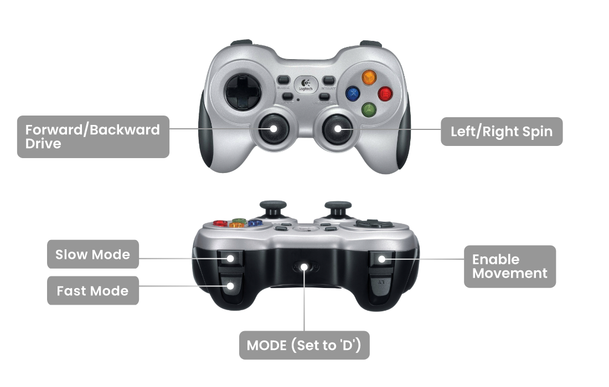

# rosbot-gamepad

A GitHub template for ROSbot 2 PRO or ROSbot 2R: a gamepad control 

Clone this repository in the ROSbot's terminal:

```
git clone https://github.com/husarion/rosbot-gamepad.git
```

> **Firmware version**
>
> Before running the project, make sure you have the correct version of a firmware flashed on your robot.
>
> Firmware flashing command (run in the ROSbot's terminal)
>
> ```
> docker stop rosbot microros || true && docker run \
> --rm -it --privileged \
> husarion/rosbot:humble-22-11-25 \
> /flash-firmware.py /root/firmware.bin
> ```

Connect a gamepad (tested on [Logitech F710](https://husarion.com/tutorials/ros-equipment/gamepad-f710/)) to the **USB port of ROSbot**.

In the ROSbot's terminal execute (in `/home/husarion/rosbot-gamepad` directory):

```
docker compose up
```

## Controlling the robot



> [!NOTE]
> More details on the use of the **F710 Gamepad** in ROS 2 can be found in Husarion's article in the [ROS Equipment section](https://husarion.com/tutorials/ros-equipment/gamepad-f710/).